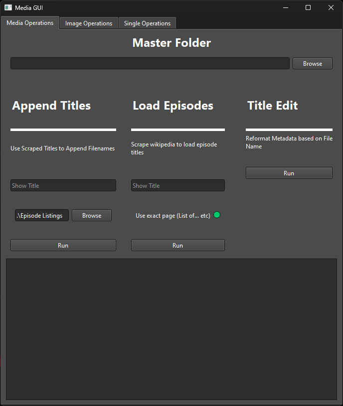
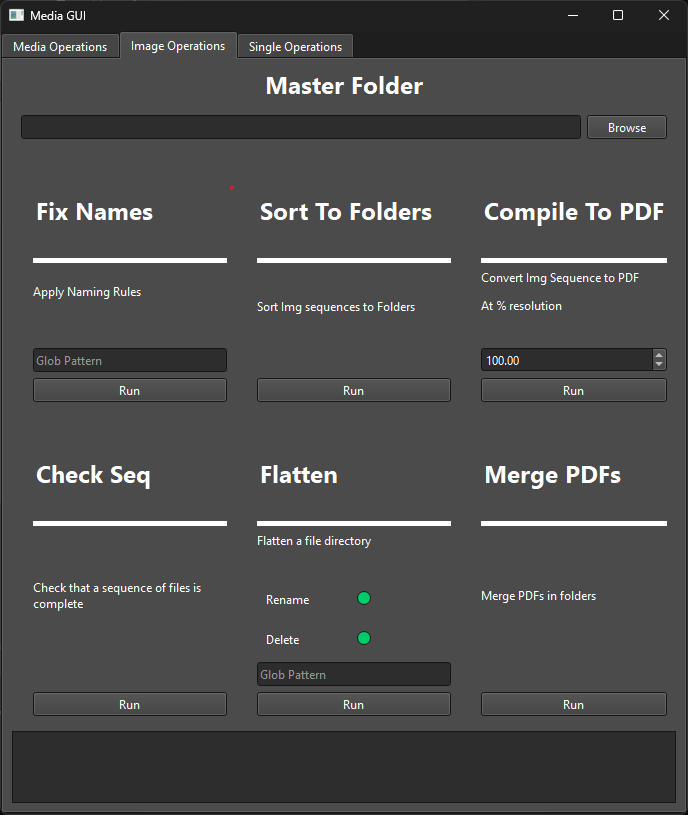
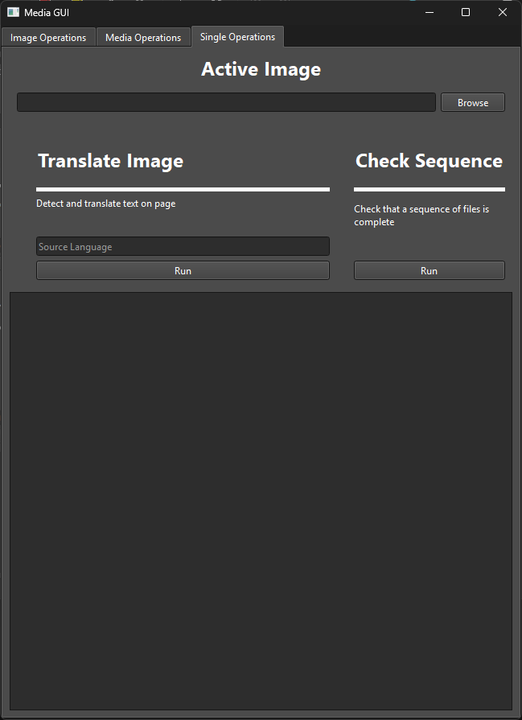

# File Operations Tool

Tool written using PyQt6 for simplifying repeated file operations when I was formatting files. Made hyper-specialized for my needs, but if someone else gets use out of it, then groovy.

## Features

### Automatic Title Scraping



Features for fixing TV Show or Movie files

- Automatically scrapes the titles of a TV Show from Wikipedia
- Appends the titles to a folder of files
- Fixes the Metadata to Match the filename
- Supports both MP4 and MKV

### Image Folder Manipulations



Features designed for sequences of mixed photos or files

- Fix non-standard naming conventions (rules fixed to my personal preference)
- Sort Files to Folders based on file name (File 1.txt,File 2.txt... -> /File)
- Compile subfolders of images or pdfs into master PDFs (designed for comics or image sequences)
- Trim borders from images
- Decompile PDF/GIF/Video files into image sequences

### Single Image Operations



Features to transform or create a single image or file

- Translate an image to English
- Check file sequences, i.e. File_1.txt -> File_100.txt and checks if all sequential files are present

## Run

Written using [uv Package Manger](https://github.com/astral-sh/uv)

```powershell
uv run .\run.py
```
