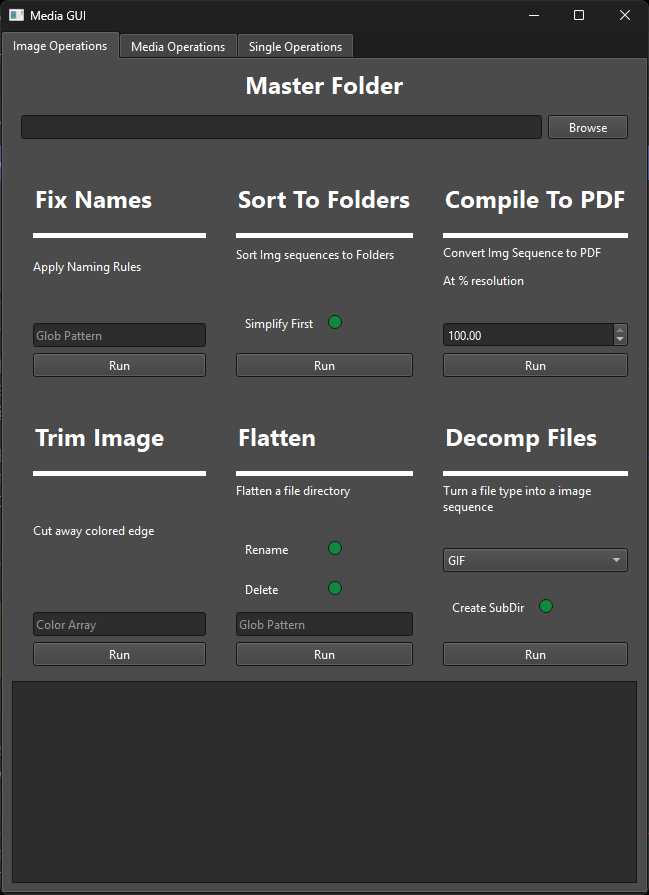

# File Operations Tool

Tool written using PyQt6 for simplifying repeated file operations when I was formatting files for my media server.

## Features

### Automatic Title Scraping


Features for fixing TV Show or Movie files

- Automatically scrapes the titles of a TV Show from Wikipedia
- Appends the titles to a folder of files
- Fixes the Metadata to Match the filename
- Supports both MP4 and MKV

### Image Folder Manipulations



Features designed for sequences of mixed photos or files

- Fix non-standard naming conventions (rules fixed to my personal preference)
- Sort Files to Folders based on file name (File 1.txt,File 2.txt... -> /File)
- Compile subfolders of images into PDF format (designed for comics or image sequences)
- Check file sequences, i.e. File_1.txt -> File_100.txt and checks if all sequential files are present
- Flatten a series of subdirectories into a master directory
- Merge PDFs in folders into master pdfs for each folder

### Single Image Operations


Features to transform a single image or file

- Split an image into grid components
- Translate an image to English
- Trim the borders of an image away
- Decomplile a PDF to image sequence
 
## Run

Written using [Uv Package Manger](https://github.com/astral-sh/uv)

```powershell
uv run .\run.py
```
